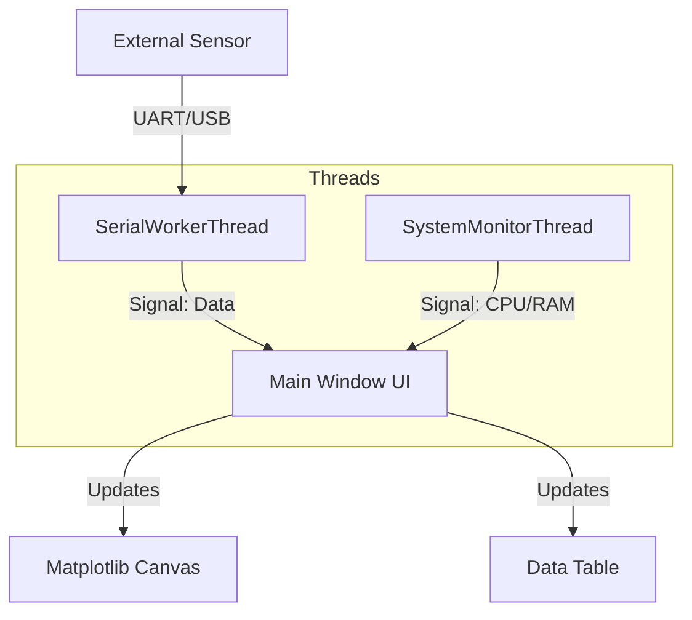

# 📊 Industrial Sensor Monitoring Dashboard


A robust, real-time desktop dashboard designed for monitoring industrial sensor data. This application visualizes critical metrics (Temperature, Vibration, Speed, Pressure, Optical Counts), monitors system health, and enforces safety thresholds via an alarm system.

It supports two operational modes: **Simulation Mode** for testing/demonstration and **Serial Mode** for live hardware integration.


*(Replace this line with an actual screenshot of your dashboard in the `docs` folder)*

---

## ✨ Key Features

* **Real-Time Visualization:** Live plotting of sensor data using `Matplotlib` embedded in `PyQt5`.
* **Dual Operation Modes:**
    * **Simulation:** Internal multi-threaded generation of test data.
    * **Serial Integration:** Reads ASCII CSV packets from external hardware (Arduino, STM32, PLC) via USB.
* **System Health Monitoring:** Tracks the host PC's CPU, RAM, and HDD temperature using `psutil`.
* **Alarm System:** Visual and system tray alerts when sensors exceed defined safety limits.
* **Security:** Password-protected "Maintenance Console" to prevent unauthorized configuration changes.
* **Data Tools:** Snapshot logging, history clearing, and alarm log management.

---

## 🛠️ Installation

### Prerequisites
* Python 3.8+
* Physical Hardware (Optional, for Serial Mode)

### Setup
1.  **Clone the repository:**
    ```bash
    git clone https://github.com/your-username/sensor-dashboard.git
    cd sensor-dashboard
    ```

2.  **Install dependencies:**
    ```bash
    pip install PyQt5 matplotlib pyserial psutil
    ```

---

## 🚀 Usage

### 1. Running Simulation Mode
Run this to test the UI logic without hardware. It generates random noise data to mimic real sensors.

```bash
python Backend_With_Random_Data.py
```

### 2. Running Serial Mode (Live Data)
1.  Connect your hardware device.
2.  Open `Backend_With_Serial_Data.py` and update the configuration at the top:
    ```python
    SERIAL_PORT = 'COM8'   # Update to your port (e.g., /dev/ttyUSB0 or COM3)
    SERIAL_RATE = 115200
    ```
3.  Run the script:
    ```bash
    python Backend_With_Serial_Data.py
    ```

### 3. Running the Executable (Windows)
If you have downloaded the release version, simply run the `.exe` file. No Python installation is required.
* **File:** `SensorDashboard.exe`
* *Note: The executable connects to the default COM port compiled into the script.*

---

## 📡 Communication Protocol

For Serial Mode, the hardware must stream ASCII data ending with a newline `\n`.

**Format:** `Temperature,Vibration,Speed,Pressure,Counter,Timestamp`

| Index | Field | Unit | Type | Example |
| :--- | :--- | :--- | :--- | :--- |
| 0 | Temperature | °C | Float | `37.5` |
| 1 | Vibration | Hz | Float | `12.2` |
| 2 | Speed | RPM | Float | `88.9` |
| 3 | Pressure | Bar | Float | `10.5` |
| 4 | Counter | Count | Int | `45` |
| 5 | Timestamp | Time | String | `14:30:55` |

**Example Packet:**
```text
37.5,12.2,88.9,10.5,45,14:30:55
```

---

## 🏗️ Project Architecture

The application uses a multi-threaded architecture to ensure the GUI remains responsive while processing high-frequency data.



* **`SerialWorkerThread`:** Handles UART communication, packet parsing, and error handling.
* **`SystemMonitorThread`:** Asynchronously queries OS metrics.
* **`MainWindow`:** Manages the Event Loop, plotting logic, and alarm validations.

---

## 📂 Repository Structure

```text
├── assets/                 # Icons and logos
├── Backend_With_Random_Data.py  # Simulation logic
├── Backend_With_Serial_Data.py  # Real hardware logic
├── Dialogs.py              # Custom popup classes (Password, Alerts)
├── front.py                # PyQt5 UI layout (Generated)
└── README.md               # Documentation
```

## 🛡️ License

This project is licensed under the MIT License - see the [LICENSE](LICENSE) file for details.
